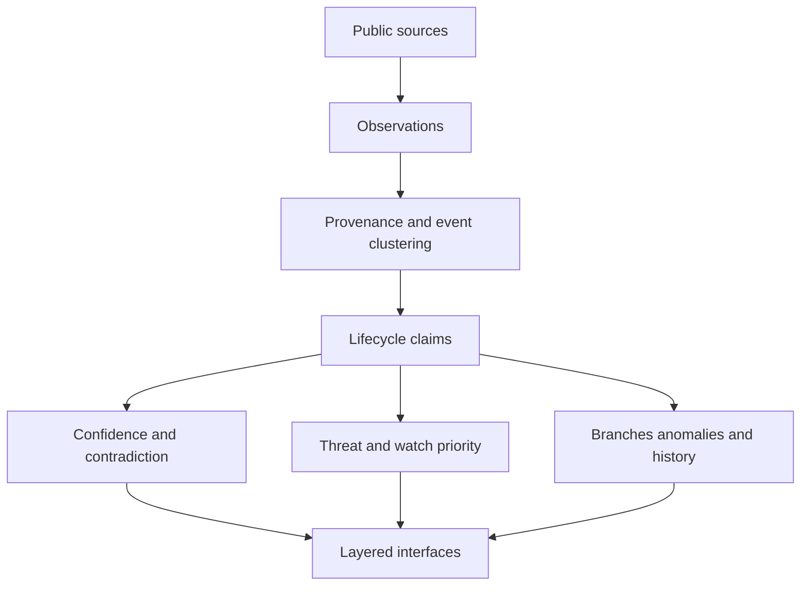
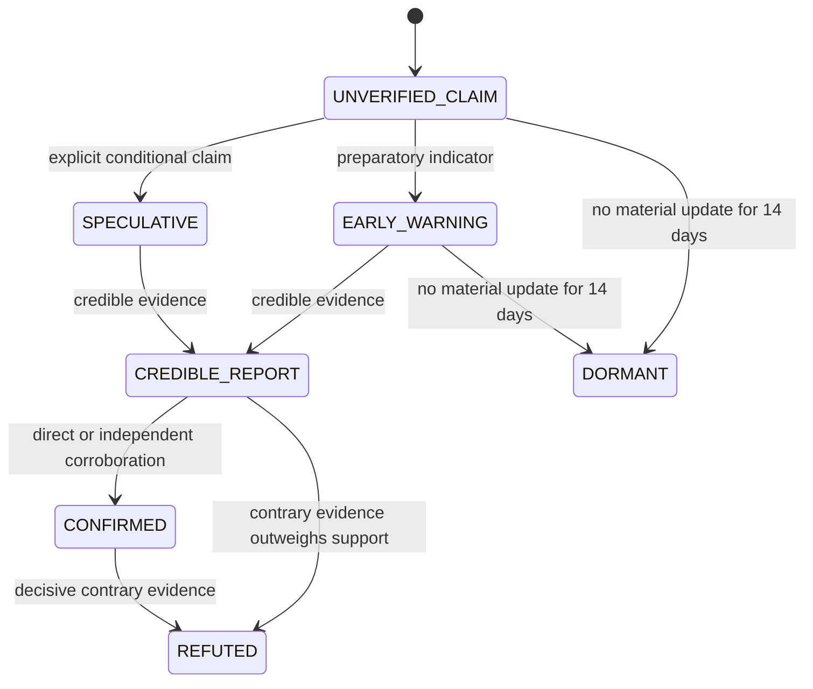

# Y&Y v3 architecture

## Design rule

Y&Y separates what was observed, what multiple observations jointly claim, how much the system believes that claim, and how consequential it might be. Those are different questions and different records.

## Records

| Record | Stable key | Meaning |
|---|---|---|
| Observation | source + canonical URL + title | One published item or sensor/legal record |
| Claim | first clustered observation signature | One underlying event followed across publications and time |
| Provenance root | originating organization/wire/attribution | The independence unit; republication does not create corroboration |
| Audit record | claim + evaluation time | Inputs, components, classification reason, scores, and direction |
| Historical memory | claim ID | Retained compact pattern record including peak confidence/watch |

Observations are never silently discarded by the analysis pipeline. Claim groups are rebuilt from the retained observations on each run with title, event-stage, and time checks; prior assignments cannot lend unrelated evidence to a new event. Historical memory retains prior claim IDs and peak scores when groups change. Refuting observations attach to `contradictory_observation_ids`; refuted claims remain in claims, memory, and audit output. Material publication time—not feed polling time—drives decay and dormancy.

## State machine

Any state can lose confidence as evidence ages or contradictions appear. Dormancy is archival, not deletion. New reporting about an older development may form a new claim linked through historical memory rather than renew an old event.

## Products

- `observations.json.gz`: full retained evidence records.
- `claims.json.gz`: current lifecycle claims with evidence, contradictions, confidence, branch analysis, links, and scores.
- `audit-log.json.gz`: one explicit classification record per current claim evaluation.
- `historical-memory.json.gz`: compact retained recurring-pattern memory, including prior claim IDs.
- `anomalies.json`: cross-domain near-time convergence cues.
- `edges-live.json`: a bounded graph of claim, actor, region, domain, provenance, anomaly, and historical-memory nodes. Every relationship is labeled `DIRECT`, `REPORTED`, `ANALYTICAL`, or `HISTORICAL`; identity masking never changes the underlying evidence state.
- `autonomy-status.json` and `source-registry.json`: ingestion, source, coverage, state, confidence, and freshness diagnostics.
- Page-specific files are views of the same claims; they do not create a second truth system.

The four complete stores are compressed to stay within GitHub's per-file limit. Browser-facing products remain ordinary JSON. During migration, the engine reads legacy `.json` files and replaces them with `.json.gz` archives after a successful write.
